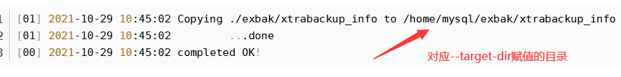

# 全量备份
```shell
mariabackup --backup --target-dir=/home/mysql/backup --user=root --password=Lz4pu61OziNQ
```
# 恢复之前需要“预恢复”
```shell
mariabackup --prepare --target-dir=/home/mysql/backup
```
# 停止mariadb服务
```shell
systemctl stop mariadb
```
# 清空数据目录（高危操作）
```shell
rm -rf /var/lib/mysql/*
```
# 执行数据恢复
```shell
mariabackup --copy-back --target-dir=/home/mysql/backup
```   
# 执行成功如下：

# 检查文件所属用户所属组，有问题则修改
```shell
chown -R mysql:mysql /var/lib/mysql
```
# 启动服务检查测试
```shell
systemctl start mariadb
```
# 搭建主从
```shell
# 主库
grant replication slave on *.* to 'replicater'@'%' identified by 'asdasadjk';
# 从库
change master to master_host='172.16.x.x',master_user='root',master_password='xxxx',master_log_file='mysql-bin.000070',master_log_pos=159510160;
start slave
show slave status\G
```
